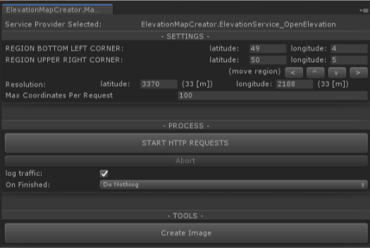

# Elevation data downloader

#
Project goals:
- Enable download of specific elevation data ranges
- Create lossless heightmap files
#
Features:
- Raw elevation data is stored in csv accumulator files
- CSV can be converted to 1 channel * 16bit PNG (you can convert those to RAW by yourself if needed)
- Program uses Http Get or Post methods to communicate.
- You can use https://github.com/andrew-raphael-lukasik/pngcs to import those 16bit png as Texture2D
- Implemented data providers:

    - api.open-elevation.com/api/ (default)
    
    - maps.googleapis.com/maps/api/elevation/ (requires key)
    
- IElevationServiceProvider makes adding new data providers easy 
#
Workflow:
1. Specify latitude/longitude rect (fields)
2. Specify resolution (fields)
3. Specify "Max Coordinates Per Request" (field)
4. Hit Start (button) and specify csv file name
5. Now wait^2. Depending on rect and resolution this process will take anywhere from minutes to many hours

    pro tip: let it run while you sleep or on another machine/unity instance

6. This process can be Aborted (button) and started over again when targeting the same csv file (dialog window will show up) 
7. Occasional connection or time-out errors are to be expected. But 100% constant errors needs your attention - when that happens try lowering Max coordinates per request by half and repeat (this limit depends on data provider, server load etc. and can vary a lot for different providers).
#
